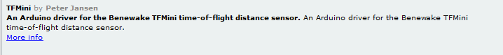
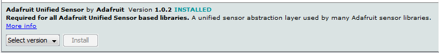

# Install Arduino ARI and libraries. Compile all.

[TOC]

 Qui si trova la descrizione del processo di installazione dei software necessari a compilare, modificare e scaricare il firmware su ARI V3.
 L’installazione prevede l’IDE Arduino e le librerie e borad necessarie. Il Git per la clonazione e aggiornamento dell’intero progetto. 
 Per l’uso dell’ambiente Arduino si fa riferimento ai vari tutorial disponibili in rete. 

## Install Arduino

<https://www.arduino.cc>

## Install esp8266 boards

 Avviare Arduino IDE, in file/preferences inserire in additional Board manager inserire   “<http://arduino.esp8266.com/stable/package_esp8266com_index.json>”

 Aprire Arduino IDE tools/Boards/Board manager e cercare esp8266, installare.

## Install libraries

Le librerie aggiungono una serie di funzioni al firmware di base. Vanno installate come segue.

Da Arduino IDE Sketch/include library/ manage library

Si collega alla rete e cerca le librerie disponibili. In “filter your search” mettere le librerie indicate sotto.

 

 

 

 Quella del drive motori e del wifiManager si ottengono da

<https://github.com/TheArduinist/DRV8833>

 https://github.com/tzapu/wifimanager

 selezionare l’opzione *download .zip* da Arduino IDE sketch/include library/ add zip library

 

  

## Install git

Git è il Sistema che useremo per comdividere le modifiche al fw che faremo. All’inizio lo usiamo solo per clonare il repository dal server.

Installazione con GUI: <https://desktop.github.com/>

Installazione della solo riga di commando: <https://git-scm.com/>

## clone project

Andiamo a creare sul disco locale una copia della struttura di file presente in rete. 

creare un folder dove clonare il progetto. Es “C:\.....\00_testGit”

aprire una shell di comando “cmd” 

portarsi sulla directory creata, “cd C:\.....\ 00_testGit”

da riga di commando eseguire 

`git clone --recursive https://github.com/stuffcube/ARI_V3.git`” 

 

Al termine del processo sotto “00_testGit“ si avrà la seguente struttura.

## Compilare

 Il sistema è composto da due processori. Un Arduino ATmega 2560 che gestisce il robot e un ESP8266 su scheda WeMos D1 R1 che si occupa della comunicazione WiFi e del ricevitore IR. Le due schede si scambiano dati via seriale. 

**ATmega set board**

 Il suo sketch si trova in “\ARI_V3\02_fwArianna\ariPi_2DC_esp_08”. La board per la compilazione è “Arduino Mega or Mega2560”. 

**WeMos D1 R1**

 Il suo sketch si trova in ARI_V3\02_fwArianna\serverTcp_IR_Receiver_01”. La board per la compilazione è “WeMos D1 R1”.

 Il cambio board è mostrato nelle figure successive.

 

 Nella riga di stato inferiore sinistra appare la scheda selezionata.

 

  

## Scaricamento del FW

 Selezionare il progetto e la board corretta, vedi sopra,  collegare il cavo a una scheda alla volta, selezionare la porta su Tools/Port.
 Premere sull’icona con la freccia verso destra, il progetto verrà ricompilato e scaricato.

 Sulla finestra di monitor inferiore appariranno delle informazioni sullo stato delle operazioni.

 Attivando il “monitor della seriale” in “tools” e impostando i parametri di comunicazione a 115200 baud dovrebbe apparire il seguente messaggio.

 Per accedere alla porta di programmazione del WeMos è necessario aprire la scatola. Modificare il suo firmware è un evento più raro. Se è già stato programmato al momento potete tralasciare la sua programmazione.

 

 

Un messaggio simile si ha all’avvio del WeMos..

 